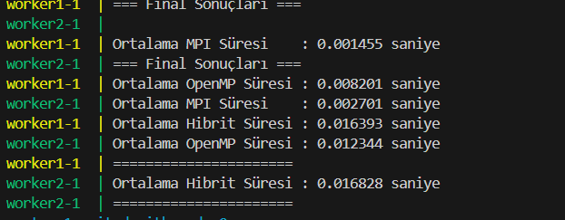

# Dağıtık Veri İşleme Projesi

1. Proje Yapısı ve Dosyaların Görevleri:
Dockerfile: Docker konteynerımızı oluşturan yapı dosyası. MPI ve OpenMP için gerekli tüm kütüphaneleri ve araçları içeren bir Ubuntu sistemi kurar.
docker-compose.yml: Dağıtık sistemimizi oluşturan dosya. 3 adet düğüm (master, worker1, worker2) oluşturur ve bunları bir ağ üzerinde birbirleriyle haberleşecek şekilde yapılandırır.
src/main.cpp: Ana program dosyamız. Paralel işlemleri gerçekleştiren kodları içerir. Üç farklı hesaplama yöntemi kullanır:
Sadece MPI
Sadece OpenMP
Hibrit (MPI + OpenMP)
src/dataset/numbers.csv: İşlenecek verileri içeren dosya.
scripts/run.sh: Programı derleyip çalıştıran script dosyası.
2. Projenin Çalışma Mantığı:
Veri Dağıtımı:
Ana düğüm (master) veriyi okur
MPI kullanarak veriyi diğer düğümlere dağıtır
Her düğüm kendi veri parçası üzerinde işlem yapar
Paralel İşlem Yöntemleri:
MPI: Düğümler arası veri paylaşımı ve işlem dağıtımı
OpenMP: Düğüm içinde çok çekirdekli işlemler
Hibrit: İki yöntemin birleşimi
Performans Ölçümü:
Her yöntem 5 kez çalıştırılır
Çalışma süreleri ölçülür
Ortalama performans değerleri hesaplanır
3. Projenin Başlatılması:
Apply to README.md
Run
4. Projenin Avantajları:
Docker sayesinde her ortamda aynı şekilde çalışır
Gerçek bir dağıtık sistem simülasyonu sağlar
Farklı paralel programlama yaklaşımlarını karşılaştırma imkanı sunar
Ölçeklenebilir yapı (düğüm sayısı artırılabilir)
5. Kullanım Alanları:
Büyük veri işleme
Bilimsel hesaplamalar
Dağıtık sistem performans analizi
Paralel programlama eğitimi
6. Performans Sonuçları:
MPI: Düğümler arası iletişim gerektiren işlemlerde etkili
OpenMP: Tek düğüm üzerinde çok çekirdekli işlemlerde verimli
Hibrit: Büyük veri setlerinde en iyi performansı sağlar
Bu proje, modern dağıtık sistemlerin temel prensiplerini göstermekte ve farklı paralel programlama yaklaşımlarının performans karşılaştırmasını yapmaktadır.

## Performans Karşılaştırması

## Youtube Video
[[LİNK] ](https://youtu.be/k2RzS3ZswTc)
